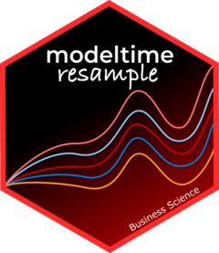

<!-- README.md is generated from README.Rmd. Please edit that file -->

```{r, include = FALSE}
knitr::opts_chunk$set(
  collapse = TRUE,
  comment = "#>",
  message = F,
  warning = F,
  paged.print = FALSE,
  fig.path = "man/figures/README-",
  # out.width = "100%"
  fig.align = 'center'
)

library(modeltime)
library(modeltime.resample)
```

# modeltime.resample 

<!-- badges: start -->
[](https://CRAN.R-project.org/package=modeltime.resample)


[](https://github.com/business-science/modeltime.resample/actions)
[](https://codecov.io/gh/business-science/modeltime.resample?branch=master)
<!-- badges: end -->

> __Model Performance and Stability Assessment Tools__ for Single Time Series, Panel Data, & Cross-Sectional Time Series Analysis


A `modeltime` extension that implements ___forecast resampling tools___ that assess __time-based model performance and stability__ for a single time series, panel data, and cross-sectional time series analysis.


```{r, echo=F, out.width='100%'}
knitr::include_graphics("man/figures/cross_validation_plan.jpg")
```

## Benefits: What Modeltime Resample Does

Resampling time series is an important strategy to __evaluate the stability of models over time.__ However, it's a pain to do this because it requires multiple for-loops to generate the predictions for multiple models and potentially multiple time series groups. __Modeltime Resample simplifies the iterative forecasting process taking the pain away.__

Modeltime Resample makes it easy to:

1. __Iteratively generate predictions__ from time series cross-validation plans.
2. __Evaluate the resample predictions__ to compare many time series models across multiple time-series windows.

Here is an example from [_Resampling Panel Data_](https://business-science.github.io/modeltime.resample/articles/panel-data.html), where we can see that Prophet Boost and XGBoost Models outperform Prophet with Regressors for the Walmart Time Series Panel Dataset using the 6-Slice Time Series Cross Validation plan shown above. 

```{r, echo=F, out.width='100%', fig.cap="Model Accuracy for 6 Time Series Resamples"}
knitr::include_graphics("man/figures/plotly_resample_error_plot.jpg")
```

```{r, echo=F, out.width='80%', fig.cap="Resampled Model Accuracy (3 Models, 6 Resamples, 7 Time Series Groups)"}
knitr::include_graphics("man/figures/gt_accuracy_table.jpg")
```

## Installation

Install the CRAN version:

``` r
# Not on CRAN yet
# install.packages("modeltime.resample")
```

Or, install the development version:

``` r
remotes::install_github("business-science/modeltime.resample")
```

## Getting Started

1. [Getting Started with Modeltime](https://business-science.github.io/modeltime/articles/getting-started-with-modeltime.html): Learn the basics of forecasting with Modeltime. 
2. [Resampling a Single Time Series](https://business-science.github.io/modeltime.resample/articles/getting-started.html): Learn the basics of time series resample evaluation. 
3. [Resampling Panel Data](https://business-science.github.io/modeltime.resample/articles/panel-data.html): An advanced tutorial on resample evaluation with __multiple time series groups (Panel Data)__

 

## Learning More

[_My Talk on High-Performance Time Series Forecasting_](https://youtu.be/elQb4VzRINg)

<a href="https://www.youtube.com/embed/elQb4VzRINg" target="_blank"></a>


Time series is changing. __Businesses now need 10,000+ time series forecasts every day.__ This is what I call a _High-Performance Time Series Forecasting System (HPTSF)_ - Accurate, Robust, and Scalable Forecasting. 

 __High-Performance Forecasting Systems will save companies MILLIONS of dollars.__ Imagine what will happen to your career if you can provide your organization a "High-Performance Time Series Forecasting System" (HPTSF System).

I teach how to build a HPTFS System in my __High-Performance Time Series Forecasting Course__. If interested in learning Scalable High-Performance Forecasting Strategies then [take my course](https://university.business-science.io/p/ds4b-203-r-high-performance-time-series-forecasting). You will learn:

- Time Series Machine Learning (cutting-edge) with `Modeltime` - 30+ Models (Prophet, ARIMA, XGBoost, Random Forest, & many more)
- NEW - Deep Learning with `GluonTS` (Competition Winners)
- Time Series Preprocessing, Noise Reduction, & Anomaly Detection
- Feature engineering using lagged variables & external regressors
- Hyperparameter Tuning
- Time series cross-validation
- Ensembling Multiple Machine Learning & Univariate Modeling Techniques (Competition Winner)
- Scalable Forecasting - Forecast 1000+ time series in parallel
- and more.

<p class="text-center" style="font-size:30px;">
<a href="https://university.business-science.io/p/ds4b-203-r-high-performance-time-series-forecasting">Unlock the High-Performance Time Series Forecasting Course</a>
</p>


