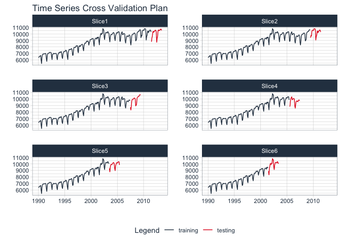

<!-- README.md is generated from README.Rmd. Please edit that file -->

# modeltime.resample

<!-- badges: start -->

<!-- badges: end -->

> Resampling Tools for Time Series Forecasting with Modeltime

A `modeltime` extension that implements ***time series resampling
tools*** for making iterative predictions and evaluating resample
results.

## Benefits: What Modeltime Resample Does

Resampling time series is an important strategy to evaluate models
across multiple time series windows. However, it’s a pain to do this
because it requires multiple for-loops to generate the predictions for
multiple models. **Modeltime Resample simplifies the iterative
forecasting process taking the pain away.**

Modeltime Resample makes it easy to:

1.  **Iteratively generate predictions** from time series
    cross-validation plans.
2.  **Evaluate the resample predictions** to compare many time series
    models across multiple time-series windows.

## Installation

Install the CRAN version:

``` r
# Not on CRAN yet
# install.packages("modeltime.resample")
```

Or, install the development version:

``` r
remotes::install_github("business-science/modeltime.resample")
```

## Getting Started

1.  [Getting Started with
    Modeltime](https://business-science.github.io/modeltime/articles/getting-started-with-modeltime.html):
    Learn the basics of forecasting with Modeltime.
2.  [Getting Started with Modeltime
    Resample](https://business-science.github.io/modeltime.resample/articles/getting-started-with-modeltime-resample.html):
    Learn the basics of time series resample evaluation.

## Evaluate Your Time Series Resamples in Minutes

Load the Following Libraries.

``` r
library(modeltime)
library(modeltime.resample)
library(timetk)
```

### Step 1 - Make a Cross-Validation Training Plan

Use functions from `rsample` or `timetk` to produce an `rset`. The
`m750_training_resamples` was made with `timetk::time_series_cv()`.

``` r
# Begin with a Cross Validation Strategy
m750_training_resamples %>%
    tk_time_series_cv_plan() %>%
    plot_time_series_cv_plan(date, value, .facet_ncol = 2, .interactive = FALSE)
```



### Step 2 - Make a Modeltime Table

Create models and add them to a *Modeltime Table* with
[**Modeltime.**](https://business-science.github.io/modeltime/articles/getting-started-with-modeltime.html)

``` r
m750_models
#> # Modeltime Table
#> # A tibble: 3 x 3
#>   .model_id .model     .model_desc            
#>       <int> <list>     <chr>                  
#> 1         1 <workflow> ARIMA(0,1,1)(0,1,1)[12]
#> 2         2 <workflow> PROPHET                
#> 3         3 <workflow> GLMNET
```

### Step 3 - Generate Resample Predictions

Generate resample predictions using `modeltime_fit_resamples()`.

``` r
m750_training_resamples_fitted <- m750_models %>%
    modeltime_fit_resamples(
        resamples = m750_training_resamples,
        control   = control_resamples(verbose = T)
    )
```

### Step 4 - Evaluate the Results

Evaluate the results with `modeltime_resample_accuracy()`.

``` r
m750_training_resamples_fitted %>%
    modeltime_resample_accuracy(summary_fns = mean) %>%
    table_modeltime_accuracy(.interactive = FALSE)
```


## Learning More

[*My Talk on High-Performance Time Series
Forecasting*](https://youtu.be/elQb4VzRINg)

<a href="https://www.youtube.com/embed/elQb4VzRINg" target="_blank"></a>

Time series is changing. **Businesses now need 10,000+ time series
forecasts every day.** This is what I call a *High-Performance Time
Series Forecasting System (HPTSF)* - Accurate, Robust, and Scalable
Forecasting.

**High-Performance Forecasting Systems will save companies MILLIONS of
dollars.** Imagine what will happen to your career if you can provide
your organization a “High-Performance Time Series Forecasting System”
(HPTSF System).

I teach how to build a HPTFS System in my **High-Performance Time Series
Forecasting Course**. If interested in learning Scalable
High-Performance Forecasting Strategies then [take my
course](https://university.business-science.io/p/ds4b-203-r-high-performance-time-series-forecasting).
You will learn:

  - Time Series Machine Learning (cutting-edge) with `Modeltime` - 30+
    Models (Prophet, ARIMA, XGBoost, Random Forest, & many more)
  - NEW - Deep Learning with `GluonTS` (Competition Winners)
  - Time Series Preprocessing, Noise Reduction, & Anomaly Detection
  - Feature engineering using lagged variables & external regressors
  - Hyperparameter Tuning
  - Time series cross-validation
  - Ensembling Multiple Machine Learning & Univariate Modeling
    Techniques (Competition Winner)
  - Scalable Forecasting - Forecast 1000+ time series in parallel
  - and more.

<p class="text-center" style="font-size:30px;">

<a href="https://university.business-science.io/p/ds4b-203-r-high-performance-time-series-forecasting">Unlock
the High-Performance Time Series Forecasting Course</a>

</p>
