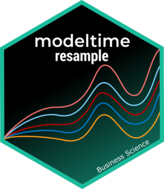
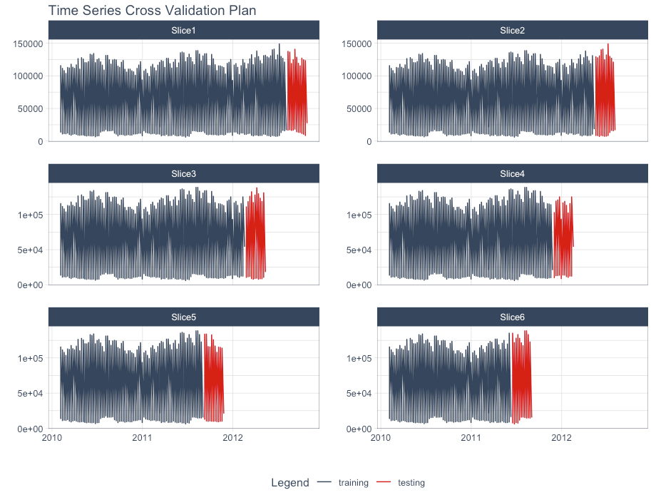
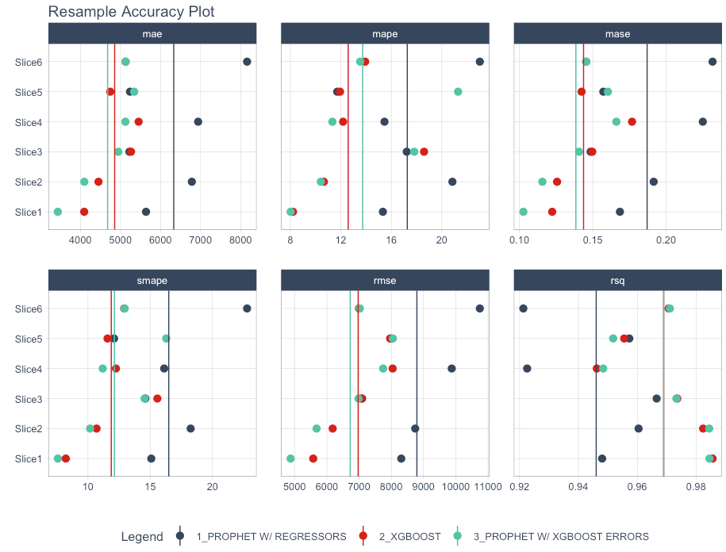
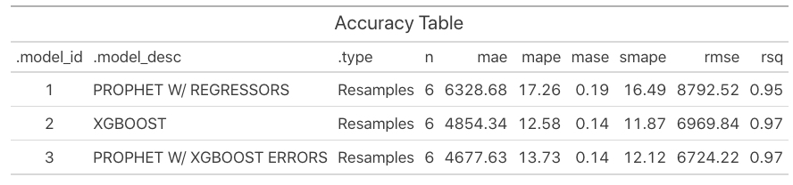

<!-- README.md is generated from README.Rmd. Please edit that file -->

# modeltime.resample <a href="https://business-science.github.io/modeltime.resample/"></a>

<!-- badges: start -->

[](https://CRAN.R-project.org/package=modeltime.resample)


[](https://github.com/business-science/modeltime.resample/actions/workflows/R-CMD-check.yaml)
[](https://app.codecov.io/gh/business-science/modeltime.resample?branch=master)
<!-- badges: end -->

> **Model Performance and Stability Assessment Tools** for Single Time
> Series, Panel Data, & Cross-Sectional Time Series Analysis

A `modeltime` extension that implements ***forecast resampling tools***
that assess **time-based model performance and stability** for a single
time series, panel data, and cross-sectional time series analysis.



## Installation

CRAN version:

``` r
install.packages("modeltime.resample")
```

Development version (latest features):

``` r
remotes::install_github("business-science/modeltime.resample")
```

## Why Modeltime Resample?

Resampling time series is an important strategy to **evaluate the
stability of models over time.** However, it’s a pain to do this because
it requires multiple for-loops to generate the predictions for multiple
models and potentially multiple time series groups. **Modeltime Resample
simplifies the iterative forecasting process taking the pain away.**

Modeltime Resample makes it easy to:

1.  **Iteratively generate predictions** from time series
    cross-validation plans.
2.  **Evaluate the resample predictions** to compare many time series
    models across multiple time-series windows.

Here is an example from [*Resampling Panel
Data*](https://business-science.github.io/modeltime.resample/articles/panel-data.html),
where we can see that Prophet Boost and XGBoost Models outperform
Prophet with Regressors for the Walmart Time Series Panel Dataset using
the 6-Slice Time Series Cross Validation plan shown above.

<div class="figure" style="text-align: center">


<p class="caption">
Model Accuracy for 6 Time Series Resamples
</p>

</div>

<div class="figure" style="text-align: center">


<p class="caption">
Resampled Model Accuracy (3 Models, 6 Resamples, 7 Time Series Groups)
</p>

</div>

## Getting Started

1.  [Getting Started with
    Modeltime](https://business-science.github.io/modeltime/articles/getting-started-with-modeltime.html):
    Learn the basics of forecasting with Modeltime.
2.  [Resampling a Single Time
    Series](https://business-science.github.io/modeltime.resample/articles/getting-started.html):
    Learn the basics of time series resample evaluation.
3.  [Resampling Panel
    Data](https://business-science.github.io/modeltime.resample/articles/panel-data.html):
    An advanced tutorial on resample evaluation with **multiple time
    series groups (Panel Data)**

## Meet the modeltime ecosystem

> Learn a growing ecosystem of forecasting packages

<div class="figure" style="text-align: center">


<p class="caption">
The modeltime ecosystem is growing
</p>

</div>

Modeltime is part of a **growing ecosystem** of Modeltime forecasting
packages.

- [Modeltime (Machine
  Learning)](https://business-science.github.io/modeltime/)

- [Modeltime H2O
  (AutoML)](https://business-science.github.io/modeltime.h2o/)

- [Modeltime GluonTS (Deep
  Learning)](https://business-science.github.io/modeltime.gluonts/)

- [Modeltime Ensemble (Blending
  Forecasts)](https://business-science.github.io/modeltime.ensemble/)

- [Modeltime Resample
  (Backtesting)](https://business-science.github.io/modeltime.resample/)

- [Timetk (Feature Engineering, Data Wrangling, Time Series
  Visualization)](https://business-science.github.io/timetk/)

## Take the High-Performance Forecasting Course

> Become the forecasting expert for your organization

<a href="https://university.business-science.io/p/ds4b-203-r-high-performance-time-series-forecasting/" target="_blank"></a>

[*High-Performance Time Series
Course*](https://university.business-science.io/p/ds4b-203-r-high-performance-time-series-forecasting/)

### Time Series is Changing

Time series is changing. **Businesses now need 10,000+ time series
forecasts every day.** This is what I call a *High-Performance Time
Series Forecasting System (HPTSF)* - Accurate, Robust, and Scalable
Forecasting.

**High-Performance Forecasting Systems will save companies by improving
accuracy and scalability.** Imagine what will happen to your career if
you can provide your organization a “High-Performance Time Series
Forecasting System” (HPTSF System).

### How to Learn High-Performance Time Series Forecasting

I teach how to build a HPTFS System in my [**High-Performance Time
Series Forecasting
Course**](https://university.business-science.io/p/ds4b-203-r-high-performance-time-series-forecasting).
You will learn:

- **Time Series Machine Learning** (cutting-edge) with `Modeltime` - 30+
  Models (Prophet, ARIMA, XGBoost, Random Forest, & many more)
- **Deep Learning** with `GluonTS` (Competition Winners)
- **Time Series Preprocessing**, Noise Reduction, & Anomaly Detection
- **Feature engineering** using lagged variables & external regressors
- **Hyperparameter Tuning**
- **Time series cross-validation**
- **Ensembling** Multiple Machine Learning & Univariate Modeling
  Techniques (Competition Winner)
- **Scalable Forecasting** - Forecast 1000+ time series in parallel
- and more.

<p class="text-center" style="font-size:24px;">
Become the Time Series Expert for your organization.
</p>
<br>
<p class="text-center" style="font-size:30px;">
<a href="https://university.business-science.io/p/ds4b-203-r-high-performance-time-series-forecasting">Take
the High-Performance Time Series Forecasting Course</a>
</p>
